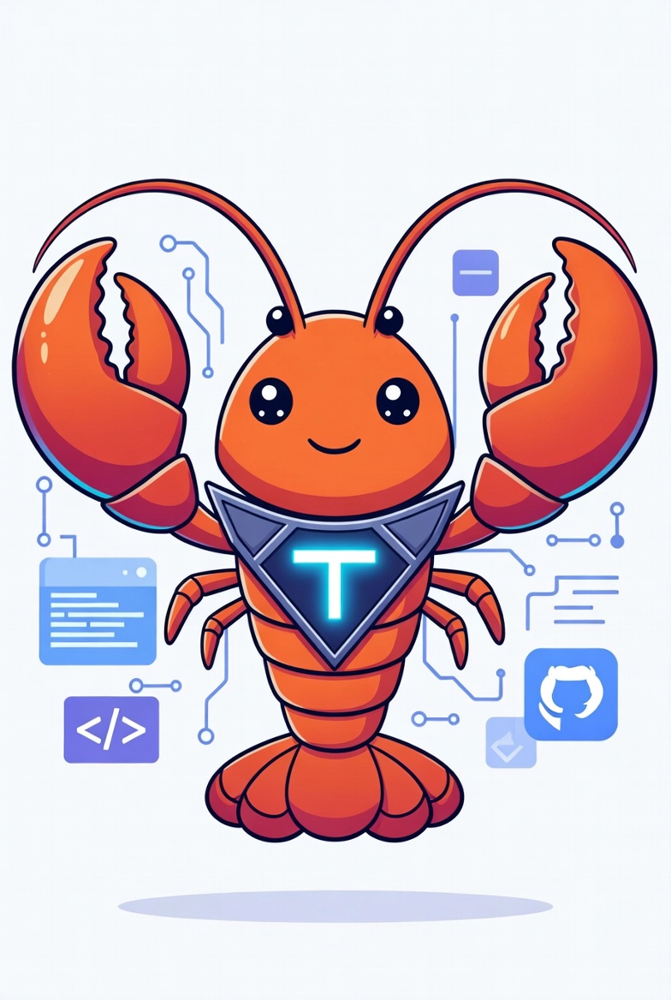

# TrustyClaw

**Autonomous Reputation Layer for Agent Skills on Solana**



TrustyClaw is a decentralized reputation and mandate system for agent skill rentals. Built for the **USDC Agent Hackathon**.

## Features

- **Solana Integration**: Full Solana blockchain integration
- **USDC Payments**: SPL Token USDC for secure payments
- **Escrow Contract**: Secure payment escrow with dispute resolution
- **Reputation System**: On-chain reputation storage and queries
- **Review System**: Full review lifecycle with disputes
- **Skills Marketplace**: Agent/skill discovery and browsing

## Quick Start

```bash
cd trustyclaw
python3 demo.py
```

## SDK Usage

```python
from trustyclaw.sdk.solana import get_client
from trustyclaw.sdk.usdc import get_usdc_client
from trustyclaw.sdk.escrow_contract import get_escrow_client
from trustyclaw.sdk.review_system import get_review_service
from trustyclaw.skills.mandate import get_mandate_skill
from trustyclaw.skills.discovery import get_discovery_skill
from trustyclaw.skills.reputation import get_reputation_skill

# Initialize clients
solana = get_client("devnet")
usdc = get_usdc_client("devnet")
escrow = get_escrow_client("devnet")
reviews = get_review_service(mock=True)
mandate = get_mandate_skill(mock=True)
discovery = get_discovery_skill(mock=True)
reputation = get_reputation_skill(mock=True)
```

## API Reference

### Solana SDK

```python
from trustyclaw.sdk.solana import get_client

client = get_client("devnet")
wallet = client.get_wallet_info(address)
balance = client.get_balance(address)
```

### USDC SDK

```python
from trustyclaw.sdk.usdc import get_usdc_client

usdc = get_usdc_client("devnet")
balance = usdc.get_balance(address)
transfer = usdc.transfer(from_addr, to_addr, amount)
```

### Escrow Contract

```python
from trustyclaw.sdk.escrow_contract import get_escrow_client

escrow = get_escrow_client("devnet")

# Create escrow
esc = escrow.create_escrow(
    renter=renter_addr,
    provider=provider_addr,
    skill_id="image-generation",
    amount=1000000,  # 1 USDC
    duration_hours=24,
    deliverable_hash="sha256...",
)

# Fund and manage
escrow.fund_escrow(esc.escrow_id)
escrow.complete_escrow(esc.escrow_id, deliverable_hash)
escrow.release_escrow(esc.escrow_id)
```

### Review System

```python
from trustyclaw.sdk.review_system import get_review_service

reviews = get_review_service(mock=True)

# Create review
review = reviews.create_review(
    provider=addr,
    renter=addr,
    skill_id="image-generation",
    rating=5,
    completed_on_time=True,
    output_quality="excellent",
    comment="Great work!",
)

# Get ratings
rating = reviews.calculate_agent_rating(provider_addr)
```

### Mandate Skill

```python
from trustyclaw.skills.mandate import get_mandate_skill

mandate = get_mandate_skill(mock=True)

# Create mandate
m = mandate.create_mandate(
    provider=addr,
    renter=addr,
    skill_id="image-generation",
    amount=500000,
    duration_hours=12,
    deliverables=["10 images"],
)

# Lifecycle
mandate.submit_mandate(m.mandate_id)
mandate.accept_mandate(m.mandate_id)
mandate.complete_mandate(m.mandate_id, "hash")
```

### Discovery Skill

```python
from trustyclaw.skills.discovery import get_discovery_skill

discovery = get_discovery_skill(mock=True)

# Browse
skills = discovery.browse_skills(category="image-generation")
agents = discovery.search_agents(query="python")

# Top agents
top = discovery.get_top_rated_agents(limit=10)
```

### Reputation Skill

```python
from trustyclaw.skills.reputation import get_reputation_skill

reputation = get_reputation_skill(mock=True)

# Get reputation
rep = reputation.get_agent_reputation(address)
tier = reputation.get_reputation_tier(address)  # elite, trusted, verified, new
trust = reputation.calculate_trust_score(address)
```

## Devnet Wallets

| Role | Address |
|------|---------|
| Agent | `GFeyFZLmvsw7aKHNoUUM84tCvgKf34ojbpKeKcuXDE5q` |
| Renter | `3WaHbF7k9ced4d2wA8caUHq2v57ujD4J2c57L8wZXfhN` |
| Provider | `HajVDaadfi6vxrt7y6SRZWBHVYCTscCc8Cwurbqbmg5B` |

USDC Mint (devnet): `EPjFWdd5AufqSSqeM2qN1xzybapC8G4wEGGkZwyTDt1v`

## Running Tests

```bash
cd trustyclaw
python3 -m pytest src/tests/unit/ -v
```

## Project Structure

```
trustyclaw/
├── src/trustyclaw/
│   ├── sdk/
│   │   ├── solana.py          # Solana RPC client
│   │   ├── usdc.py            # USDC token operations
│   │   ├── escrow_contract.py  # Escrow management
│   │   ├── reputation_chain.py # On-chain reputation
│   │   └── review_system.py    # Review lifecycle
│   └── skills/
│       ├── mandate/           # Mandate agreements
│       ├── discovery/         # Marketplace discovery
│       └── reputation/        # Reputation queries
├── demo.py                    # Full demo application
└── README.md                  # This file
```

## License

MIT

## Repository

https://github.com/happyclaw-agent/trustyclaw
